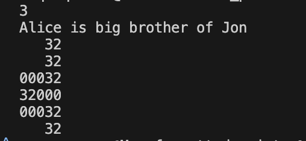
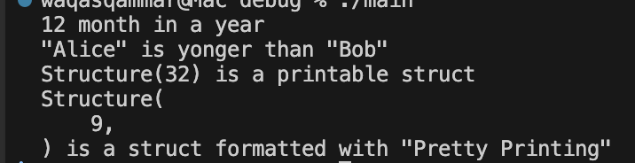
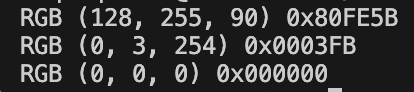

## HELLO WORLD
To build and run your very first rust program, run the following to build and run the code with rust.

```bash
cd hello_world
rustc main.rs
./main
```

## HELLO CARGO
To build with buildsystem and package manager `cargo`, run the following commands.

```bash
cargo new hello_cargo
cd hello_cargo
cargo build
cargo run
```

## FORMATTED_PRINTS
In `rust` printing is handeled by series of `macros` defined in `std::fmt`. It has many `traits` for display of text. Two important ones are:
* `fmt::Deug` uses `{:?}` marker. Format text for debugging
* `fmt::Disply` uses `{ }` marker. Format text in more elegant way

### Build & Run
``` bash
cd formatted_prints/prints
rustc main.rs
./main
```
### Output



## DEBUG
* All types which wants to use `std::fmt` formatting `traits` requires an implementation to be printable.
* All `std` library types are already printable with `{ }` and `{:?}`.
* All types can derive (automatically create) the `fmt::Debug` `trait` implementation but `fmt::Display` needs to be implemented manually.

### Build & Run
``` bash
cd formatted_prints/deug
rustc main.rs
./main
```
### Output


## DISPLAY
* `fmt::Dispay` is not implemented for generic containers e.g.`vect<T>`

For a simple use case, displaying complex number, a `fmt::Display` trait is implemented.
### Build & Run
``` bash
cd formatted_prints/display
rustc main.rs
./main
```
Implementing `fmt::Display` for a sequential structure is tricky. The problem is that `write!` generates `fmt::Result` for each member and proper handling is required for each case. Rust provides `?` for that.
```rs
// The following code try write! and see if it errors. 
// If error, return the error. Otherwise, continue.
write!(f, "{}", value)?:
```
Let's use in next build. Run the following

``` bash
cd formatted_prints/testcase
rustc main.rs
./main
```

## RGB
Implement a `fmt::Display` for Color struct such that it prints like `RGB (R, G, B), 0xrrggbb` format
### Build & Run
``` bash
cd formatted_prints/deug
rustc main.rs
./main
```
### Output
